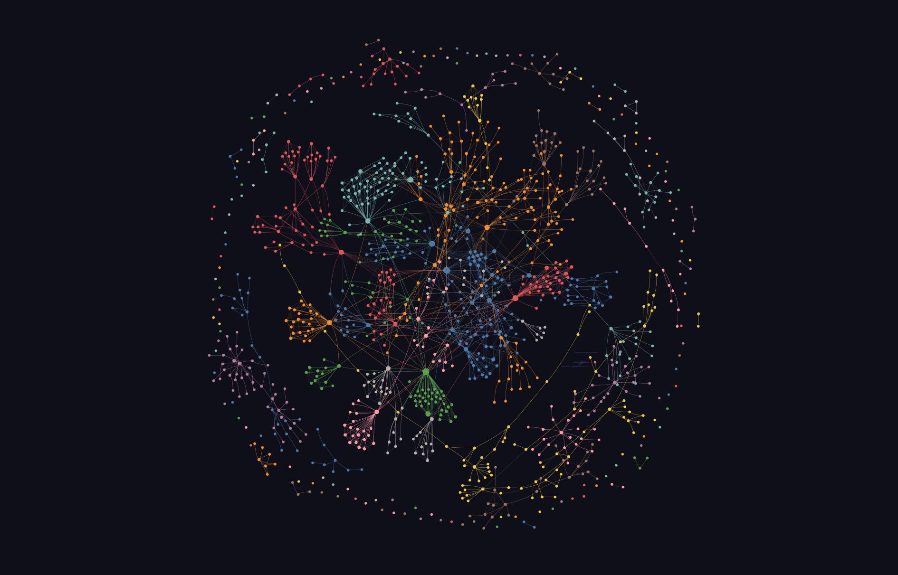
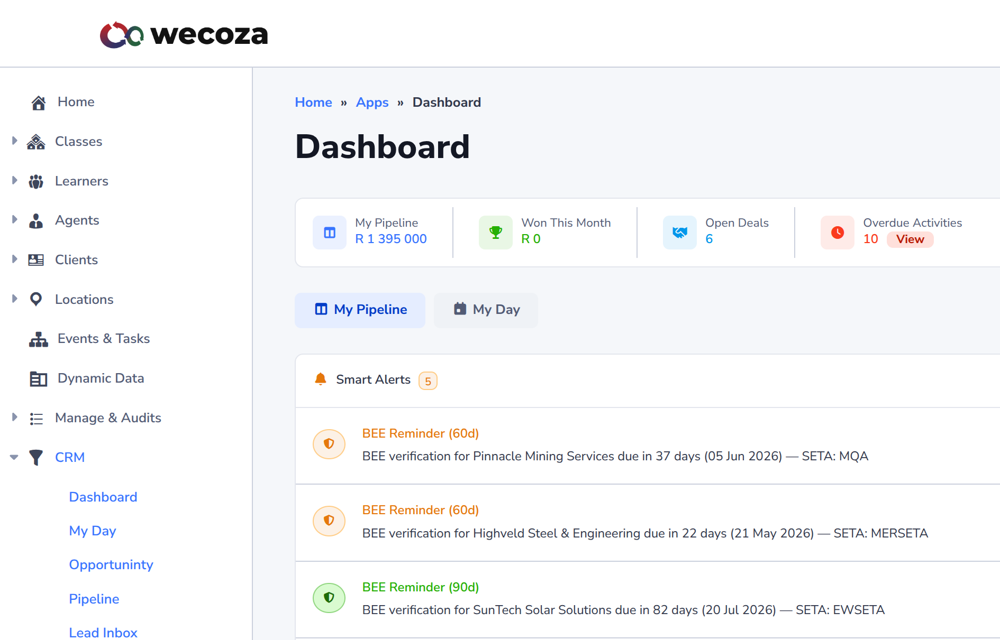
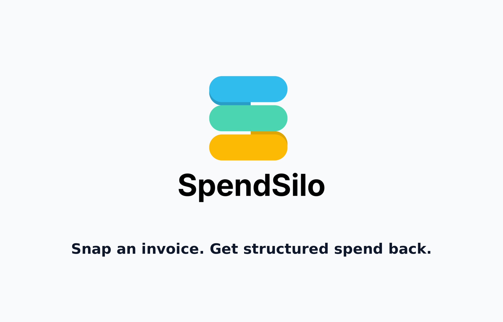
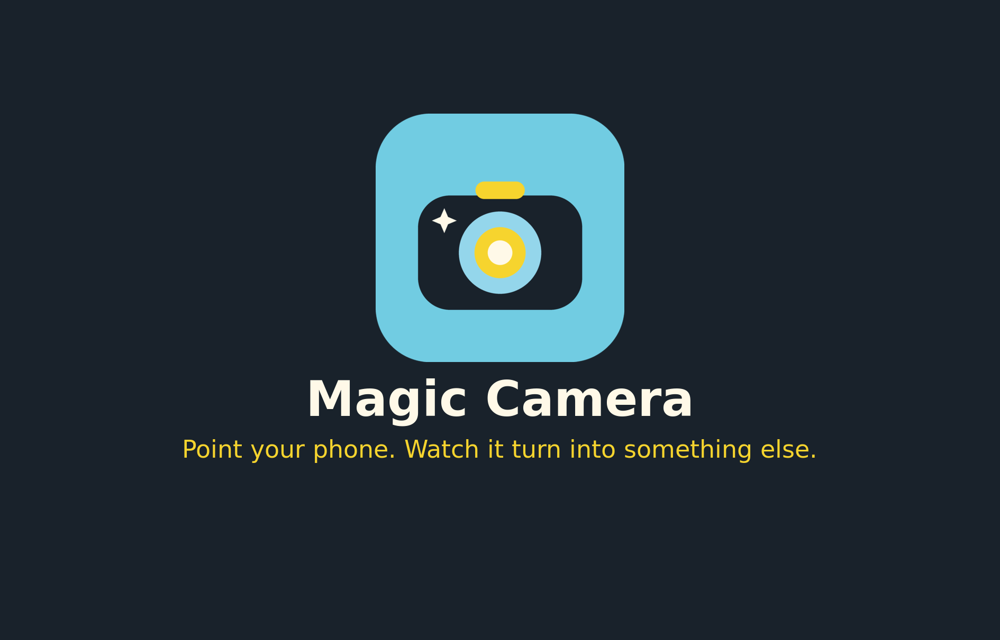
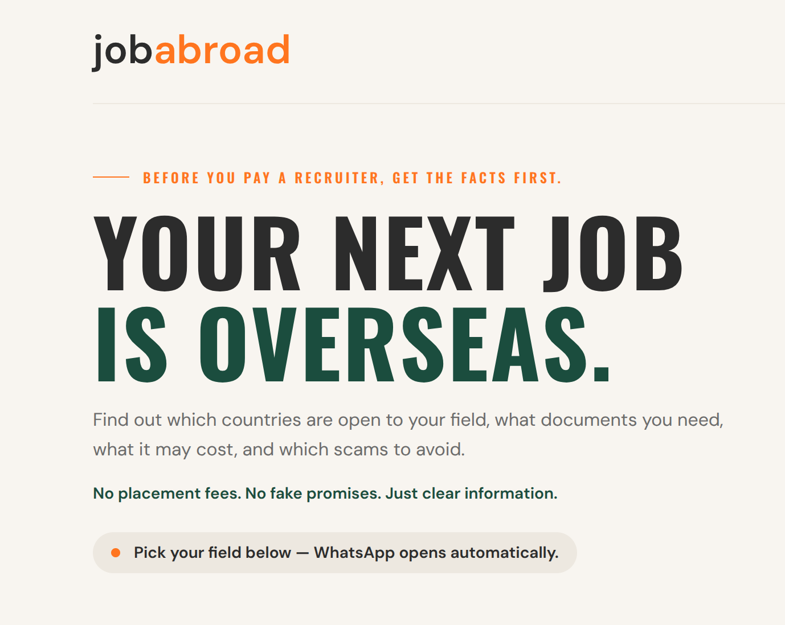
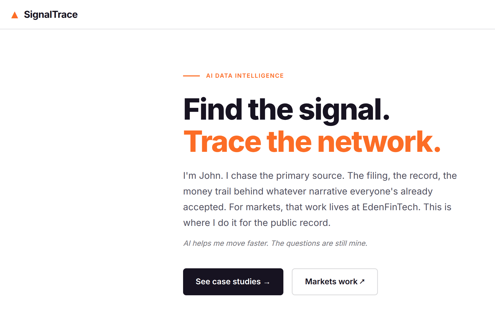
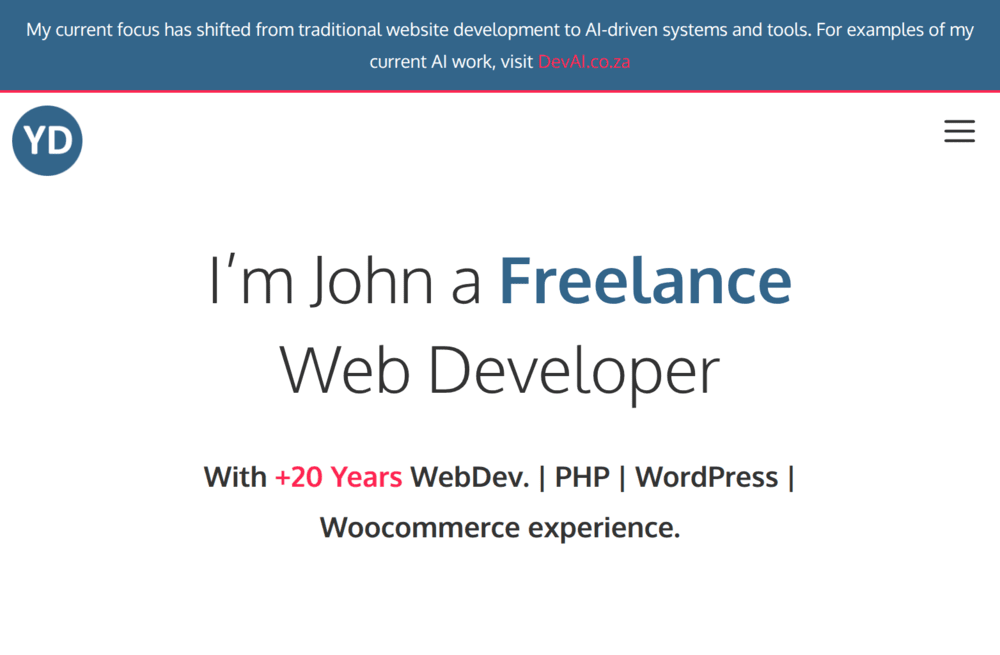

# I'm John

<aside class="profile-card">
  
John Montgomery

  

  <dl class="profile-card-info">
    <dt>Based</dt>
    <dd>Mossel Bay, South Africa <small>(UTC+2)</small></dd>
    <dt>Focus</dt>
    <dd>Adversarial AI for deep-value quant</dd>
    <dt>Founder</dt>
    <dd><a href="https://edenfintech.com/">EdenFintech</a></dd>
    <dt>Years</dt>
    <dd>22+ coding</dd>
    <dt>Contact</dt>
    <dd><a href="mailto:support@edenfintech.com">support@edenfintech.com</a></dd>
  </dl>
</aside>

I've been building software for 22 years, starting with trading systems and PHP/MySQL platforms in the early 2000s. These days I focus on AI-assisted research tools, quant workflows, and systems that turn messy information into something useful.

Based in Mossel Bay. Founder of [EdenFintech](https://edenfintech.com/).

## How I got here

I started in the early 2000s building trading tools for a trading company. From there I moved into PHP and MySQL web applications, back when most things still had to be built by hand.

That became [yourdesign.co.za](https://yourdesign.co.za/), and more than 20 years of custom websites, WordPress systems, themes, and agency work.

In many ways [EdenFintech](https://edenfintech.com/) is a return to the beginning: markets, data, research, and code. Only now, the tools are better, the thinking is sharper, and there are 22 years of hard-earned development experience behind it.

## Current availability

> [!tip]
> I'm open to interesting quant, AI, and development work where the problem is messy enough to need real engineering judgement.
>
> The work that fits best:
>
> - Building or improving quant research platforms: data ingestion, backtesting, validation, and honest performance review.
> - Turning LLM and agent experiments into proper systems with structure, logging, review stages, and fewer black boxes.
> - Complex web platforms where the data model matters and the project has outgrown simple CMS thinking.
> - Obsidian / Astro knowledge-base projects for research, OSINT, internal documentation, or public case-study sites.
> - Research-heavy AI tools that need to turn scattered information into something structured, searchable, and useful.
>
> Remote, UTC+2. Open to contract, retainer, or lead-developer roles. The [[about/cover-letter|cover letter]] has more, or reach me at info@devai.co.za.

## What I do

- [[skills/quant-engineering|Quant Engineering]]: research platforms for screening, scoring, and backtesting; honest evaluation as a first-class output.
- [[skills/ai-agentic-systems|AI / Agentic Systems]]: LLM calls behind typed adapters, contract-governed review stages, logged and reproducible.
- [[skills/wordpress-php-craft|WordPress & PHP Craft]]: custom plugins and themes, WooCommerce, and the cases where the schema needs to move beyond `$wpdb`.
- [[skills/knowledge-graphs-wiki-systems|Knowledge Graphs & Wiki Systems]]: Obsidian + Quartz research wikis, entity taxonomies, graph navigation that does real work.
- [[skills/python-services-data-pipelines|Python Services & Data Pipelines]]: the connective tissue (ingestion, snapshot hashing, CLI ergonomics, structured logging).
- [[skills/design-brand|Design & Brand]]: 20+ years of custom front-end work; the visual layer on my own sites and on client brand builds.

## Currently building

<a class="project-card-link" href="projects/edenfintech-scanner-python">

edenfintech-scanner-python
A stdlib-only core plus a multi-role LLM review stage behind a typed information barrier.
Read more →

</a>

<a class="project-card-link" href="projects/edenfintech-com">

edenfintech.com
The free weekly watchlist surfaced from the scanner's output.
Read more →

</a>

<a class="project-card-link" href="projects/wecoza-development">

WeCoza 3.0
Long-running WordPress and Postgres client engagement for a South African adult-education training provider.
Read more →

</a>

## Proof of work

Shipped projects I point to as evidence. Each one is live and built end to end.

<a class="project-card-link" href="projects/spendsilo">

SpendSilo
A PWA invoice scanner. Snap a receipt, a vision model returns it as validated JSON, and nothing auto-approves before review.
Read more →

</a>

<a class="project-card-link" href="projects/magic-camera">

Magic Camera
A child-safe PWA that turns a phone photo into AI art. Installs from the browser, no app store, no account.
Read more →

</a>

<a class="project-card-link" href="projects/jobabroad-co-za">

jobabroad.co.za
Next.js 16 + Supabase. Members-only pathway guides, semantic search with cited answers, and a paid AI coach.
Read more →

</a>

<a class="project-card-link" href="projects/signaltrace-site">

SignalTrace
A multi-wiki research site over thirteen OSINT and financial-research wikis. Active at signaltrace.wiki.
Read more →

</a>

## Legacy work

<a class="project-card-link" href="projects/yourdesign-co-za">

yourdesign.co.za
20+ years of freelance WordPress and WooCommerce. The original brand site, kept as a portfolio surface.
Read more →

</a>

## Wiki sections

This site is also a working record of how I practice. New pages land in these folders over time:

- [[decisions/|Decisions]]: positions I hold, with the reasoning attached.
- [[playbooks/|Playbooks]]: repeatable recipes I want to run the same way twice.
- [[notes/|Notes]]: dated learning log, short-form thinking.
- [[influences/|Influences]]: videos, podcasts, talks, and writing that have shaped the work.
- [[open-questions/|Open questions]]: things I'm chewing on but haven't resolved.

More on [[about/how-this-site-works|how the site is put together]].

## Talk to me

- [[about/index|About]]
- [[about/trading|Trading]]
- [[about/cover-letter|Cover letter]]
- [[about/clients|Clients & collaborators]]
- Email: support@edenfintech.com
- Phone: +27 079 177 1970
