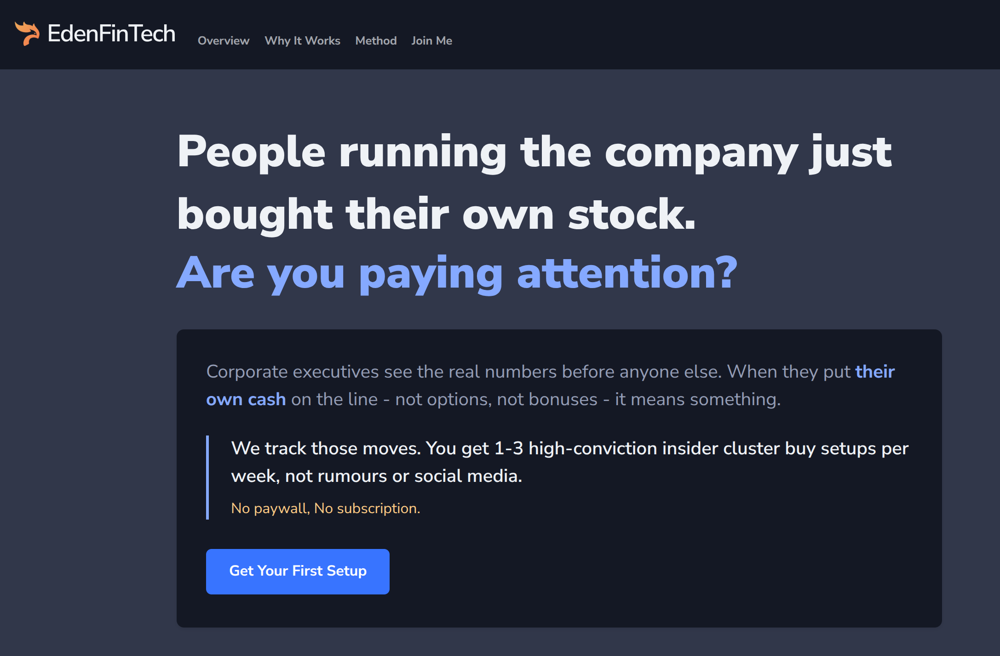

> The public face of [[projects/edenfintech-scanner-python|edenfintech-scanner-python]], a free weekly research service surfacing 1–3 "insider cluster buy" setups drawn from US SEC Form 4 filings.

**Stack:** Static / SSG marketing site, copy-heavy narrative layout.
**Status:** Live, visible "Still Under Development, content is placeholder/demo only" notice on the current build.
**Live:** [edenfintech.com](https://edenfintech.com/)

## The story

EdenFintech is the productised surface of the scanner. The pitch to a reader is simple: corporate executives see the real numbers before anyone else, and when a cluster of senior officers (CFO, COO, Directors, key VPs) put their own money, not options, not bonuses, into their company's stock above a meaningful threshold, that means something. The site picks out 1–3 setups per week from the 45,000–50,000 US "P"-coded Form 4 purchase filings that hit EDGAR each year.

The edge is explicitly ruled-based: a $500K+ dollar-size threshold, a 3× role-weight multiplier on numbers-facing execs, cluster detection over a sliding window. The site carries a 82.9% calendar-year 2024 backtest claim as the headline, with case-study hits (ATGE +68%, OSUR +52%, TLS +197%) as worked examples. It is deliberately positioned against the signal-service market, the audience is "independent decision-makers", not people looking for tips to copy.

I run the service for free because the proprietary AI models in the scanner do the filtering work that would otherwise be a full-time job. The site is the delivery channel; the real product is the pipeline behind it.

## Architecture in one breath

Marketing site → links to the weekly watchlist output produced by [[projects/edenfintech-scanner-python|edenfintech-scanner-python]] → reader.

## Proof points

- Sources US SEC Form 4 filings, ~45,000–50,000 "P" purchase filings per year.
- $500K+ dollar-size threshold; 3× role-weight on numbers-facing execs.
- 82.9% 2024 backtest return claim on the site.
- Named case studies: ATGE +68%, OSUR +52%, TLS +197%.
- Still carries an "Under Development" notice, copy and cadence still stabilising.

## What this proves

- [[skills/quant-engineering|Quant Engineering]], rules-based, backtested methodology; cluster-buy edge formally defined and documented for the reader.
- [[skills/design-brand|Design & Brand]], product-site copy, audience framing, narrative structure.
- [[skills/ai-agentic-systems|AI / Agentic Systems]], "proprietary AI models do the filtering" is the scanner's agent graph in production.

## Decisions worth a deeper read

*Populated as the decision pages land. Likely candidate: why the service is free, and what free forces me to leave on the table.*
