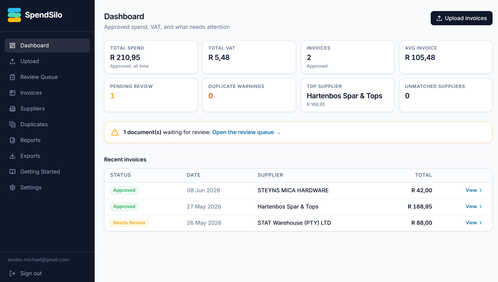

> A progressive web app that scans invoices and receipts, reads them with a vision model, and returns structured spend data that always lands in a review queue first.

**Stack:** Next.js 16 (App Router), React 19, TypeScript, Supabase (Postgres, Storage, Auth), OpenAI vision, Zod, sharp, Tailwind. Deployed on Vercel.
**Status:** Active. Built as a one-week experiment.
**Source:** private.
**Live:** [invoice-ocr-blond.vercel.app](https://invoice-ocr-blond.vercel.app/)

## The story

I built SpendSilo to answer a narrow question: how much of a "real" invoice-capture app can now live entirely in a browser tab? A few years ago this was native-app territory. Camera access, file handling, background work, offline behaviour, a home-screen icon, all of that meant shipping through an app store and waiting for review. SpendSilo does none of that. It is a website you install to your phone's home screen, open full-screen, and use like any installed app. The store step is gone.

The job it does is unglamorous. You point your phone at a supplier invoice or a till slip, or drop a stack of PDFs on the desktop, and it gives back clean fields: supplier, invoice number, date, totals, VAT, line items. It is aimed at South African businesses, so day-month-year dates, 15% VAT, and ZAR defaults are part of how it reads a document.

The part I spent the most time on is not the model call. It is everything that decides whether you can trust the model's answer. A vision model will happily return confident nonsense, so the output is treated as a claim that has to pass checks before a human ever sees it as "ready".

## How the scan-to-JSON loop works

1. You open the site and tap **Take photo** (it opens the rear camera) or pick files. On desktop you drag and drop.
2. Before anything uploads, the browser shrinks large phone photos. That saves data and stays under the upload size limit.
3. The files hit one endpoint that stores the original, creates a job, and answers straight away. You can navigate away or close the tab.
4. The reading happens in the background. The image is straightened by its EXIF orientation and downscaled to match the vision model's high-detail tile size, then sent with a South-African-invoice prompt and asked for structured JSON.
5. That JSON is checked twice. First against a strict schema for shape, then against business rules: is there a total, does subtotal plus VAT reconcile to within two cents, is the date present, does a tax invoice carry a VAT number.
6. A confidence score decides where it lands. Nothing is auto-approved, even at high confidence. Everything waits in a review queue for a person to confirm or correct.
7. Your phone polls for progress and tells you when each document is done, then links straight to the review screen.

## Architecture in one breath

Browser shrinks the image → one upload endpoint stores the original and queues the work, then responds → background task straightens and downscales, calls the vision model behind a `json_schema` contract → Zod validates shape, business rules validate the numbers → confidence scoring sets status → row written to Postgres with a full extraction log → the phone polls Supabase for progress, not the original request.

## Proof points

- Extraction runs in the background through Next.js `after()`, so closing the tab does not kill the job. The phone polls the database for status rather than holding a long request open.
- Images are shrunk twice: in the browser before upload, then on the server with EXIF straightening and a downscale to 1568px to match the model's high-detail tile (keeps vision token cost down).
- Model output is validated on two levels: a strict schema for shape, then deterministic business rules for the money (VAT reconciliation, sane totals, required fields).
- Confidence scoring weights the total amount most heavily, but nothing is ever auto-approved. Low-confidence and clean extractions both land in review.
- Duplicate detection matches on supplier, invoice number, date, and total, so the same slip uploaded twice gets flagged.
- The service worker caches the app shell and an offline page, but never caches API calls or signed image URLs, so private tenant data stays private.

## What this proves

- [[skills/ai-agentic-systems|AI / Agentic Systems]]: the vision model sits behind a typed extraction contract, `json_schema` on the way out and Zod plus business rules on the way in, with confidence scoring and a no-auto-approve rule. The same discipline as the [[projects/edenfintech-scanner-python|scanner]], applied to OCR.
- [[skills/design-brand|Design & Brand]]: the PWA shell, the install prompt, camera capture, the offline page, and the review-queue UI.

## Decisions worth a deeper read

- [[decisions/llms-behind-typed-adapters|Why I keep LLMs behind typed adapters]]

Sibling experiment from the same week: [[projects/magic-camera|Magic Camera]].
